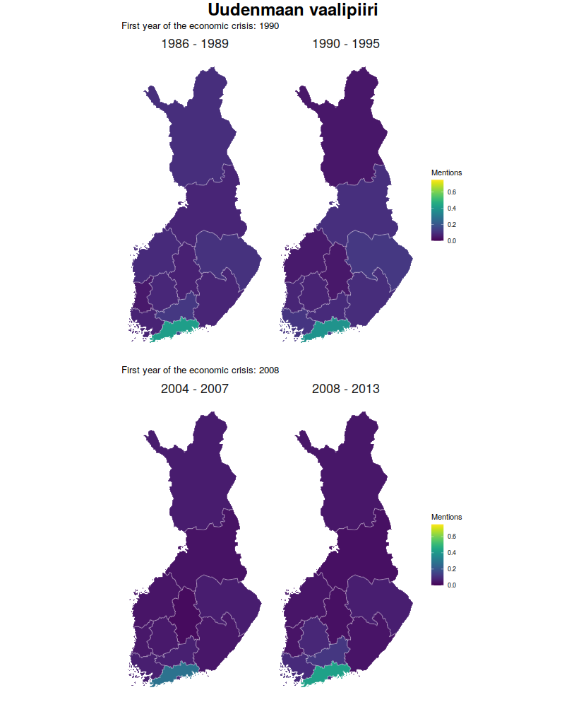
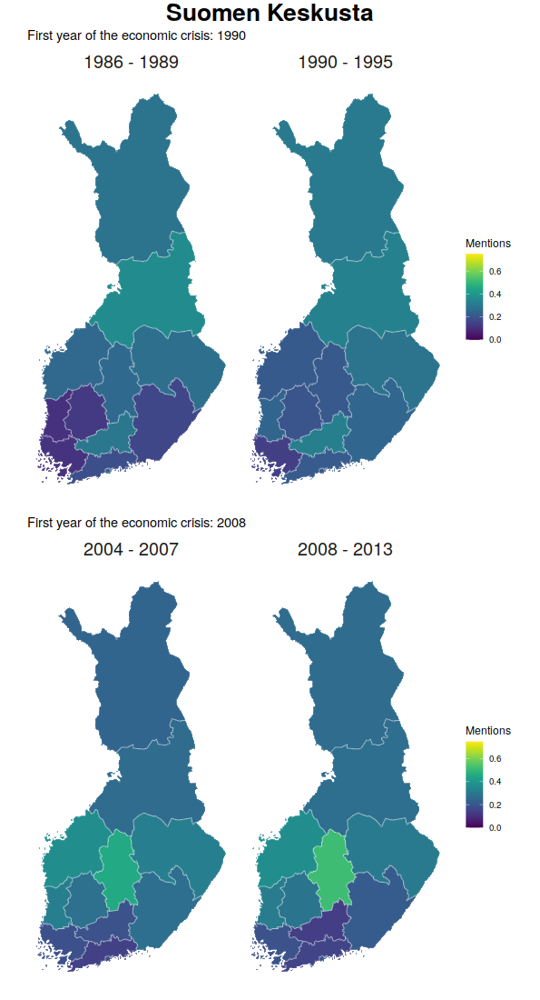

```{r setup, include=FALSE}
knitr::opts_chunk$set(echo = TRUE)
```


<!--
1)  Discuss with (or write an email to) your group leader to get information what extra work you need to do to earn the 5 credits.
2)  Choose a public venue (blog post, google docs etc.) for your portfolio.
3)  Write a documentation of your work during the hackathon (what you did as part of the group) that tells also about your experience of the project (reflect about what you brought to the group, what new did you learn, what you should learn in the future etc.). Length approximately 750-1000 words.
4)  Collect all the relevant documents, information about your groups work as a sensibly documented collection of links (code, presentation, poster) into your portfolio.
5)  Feel free to add whatever comes to mind into your hackathon portfolio.
-->

# DHH 2021 reflection

**Semparl**
  - [GitHub](https://github.com/dhh21/semparl)
  - [final blog post at DHH21 blog](https://dhhackathon.wordpress.com/2021/05/28/semparl-cities-in-parliament/)
  - [Shiny app](https://jonioks.shinyapps.io/citiesinparl/) 

***

I participated in the Digital Humanities Hackathon (DHH) 2021 as a team member in the Semantic parlament (Semparl) group. For the purposes of this hackathon, we were given access to [ParliamentSampo](https://seco.cs.aalto.fi/projects/semparl/en/), a work-in-progress search engine, where users can search for results from open data provided by the Finnish Parliament. In addition to word searches from text, the data in ParliamentSampo includes automatic background information of each document such as political party information for persons in the data and place names mentioned in the documents. After learning about ParliamentSampo and how to use it, we started working from the initial topic of “politics and place”. We discussed our interest and backgrounds related to this project, our research theme was set on researching the development of city image in the Finnish parliamentary discussions during economic crises. Our final presentation in the form of a blog post can be read [here](https://dhhackathon.wordpress.com/2021/05/28/semparl-cities-in-parliament/)

My initial interest regarding participation in DHH2021, was to cooperate with people from various backgrounds and to learn and apply methods that I will use in my personal doctoral research, i.e. modern natural language processing and language modeling tools. My background consists of mostly working with and studying quantitative and computational methods Few years ago, I was interested in working with text data and NLP, so I ended up writing my master’s thesis in statistics about [the effects of corpus size in training word embeddings](https://helda.helsinki.fi/handle/10138/323731). Before applying to the hackathon, I did not have any previous experience with digital humanities besides my finished thesis. However, I was already familiar with the topics that were presented in the application materials, but have not yet worked with the topics in the context of multidisciplinary research or collaboration.

The first days of the hackathon went so fast as we were trying to find the appropriate framework to conduct our study. After agreeing on the objectives of our brief, but in-depth analysis of parliamentary debates, I aligned myself in the data manipulation and visualization team. Both topics were something I had experience of working with and most of all I enjoyed spending my time with. Even though my personal motivation to join the hackathon was learning something new by doing, I managed to get involved with things I have already done in the past. I did not mind this at all, as I noticed how skilled I am with these things as I immediately had ideas and how to produce them once someone mentioned visualizations. Still this hackathon was a learning event and I could have utilized the chance to do something new.

From a perspective of teamwork and collaborating within our team, I also thought that I would be the most productive by focusing on creating the final outputs (i.e. [plots](https://github.com/dhh21/semparl/blob/main/plots/financial_crisis_rate.gif), [Shiny applications](https://jonioks.shinyapps.io/citiesinparl/)) as there were not that many other team members with a quantitative background. I also did not want to take full control of the whole visualization part and offered the chance for others to be able to join or take lead in the data visualization process.

In general, participating in this 10 day hackathon was an insightful experience. Most of all, I enjoyed the discussions that we had about the theme of our research. It is not easy to find a common ground without someone making tradeoffs in multidisciplinary research. I learned from my team members how they approached data from the perspective of their own background and discipline and how their thinking process formulated the research questions that they wanted to examine and how their research questions would align with the interests of other team members. In addition, I believe I was able to teach R and also speak about what R is capable of (as most of our team had used mostly Python). I still had to cut down some parts from our final presentation as we simply did neither have the time to implement them completely nor present the results of these analyses during our presentation. 

I also learned that it is important to take into account the time at your disposal. In this sense, the hackathon did not provide realistic settings as usually you don’t have only 10 days to plan _and_ conduct your research. Taking into account the 10 days of hackathon, I think our topic was a bit too ambitious, but nevertheless we managed to deliver results, which I could have not expected to be produced from scratch within 10 days. I believe that our work was showcasing the possibilities of such an extensive linked data set by focusing on something else than examining the traditional party politics or policies. Among these reasons, I was inspired to continue some of the quantitative analyses that we had no time to complete during the hackathon, but we did produce data sets, which can be used in these analyses.

# Further analysis

## Data and observations

Our DHH work focused on a more qualitative approach to find out how party politics and regional policies of MPs are represented and expressed in the dataset of parliamentary debates. One initial idea was to research if the MP's own electoral district is mentioned more often than other places.

I wanted to return to this idea, but from a quantitative aspect. During the hackathon, we did not find a way to normalize the mention count of different municipalities. As we can expect that the more populous economically more influential cities would be mentioned more often than a single rural municipality with a low and sparse population. In the hackathon, we tried using population and economic statistics, such as population or GDP, but this did not provide meaningful results as the normalized counts would not show any kind of change during time. We opted to use _rate per 100 000_, which is often used in epidemiology to present statistics at population level, but considering also the effect of change in population. However this did not show change in the relative number of how many times a single city was mentioned within a given year. In this report, I present the values normalized by the total number of speeches including a mention of a city.

## Limitations of data

As these analyses were conducted on the same datasets, which were used in our original DHH-analyses, the data is not fully applicable to thoroughly research if MPs really discuss their own electoral district more often that other parts of Finland or how to normalize the number of mentions. Thus, the results of this report are not fully reliable, but the validity could improve if the data would be recollected considering the limitations and fixing the deficiencies.

<!--
1. Limitations of data
  - only the cities included in the original DHH-SEMPARL study are considered (-> requires futher analyzing and processing the data to have more reliable and valid results of the RQ/H)

2. Electoral districts
  - plenary session data includes historical electoral districts (-> manually fixed) (2-> create a csv containing all the historical values)
  
3. Parlamentary groups
  - are defined by the MP's last/latest group, which causes some groups to appear before their inauguration as the MP has been member of multiple parlamentary groups in the past.
--->

### City name mentions

Following analyses were conducted using a dataset produced originally as a part of original DHH2021 research project "Cities in parliament". Our previous study only examined 107 municipalities, which have the [legal status of a city](https://en.wikipedia.org/wiki/List_of_cities_and_towns_in_Finland) as of 2021. There almost certainly is not included mentions, as the electoral district of Lappi includes only one city as the capital city of Helsinki is an electoral district of its own. Thus the results are highly biased towards highly populated areas, which include large cities.


### Electoral distirct

The electoral districts were added to cities by using the 2020 division provided by [geofi](https://github.com/rOpenGov/geofi) package, which uses data provided by Statistics Finland. The historical names of each have been harmonized to match their current names, but the municipality level division has not been taken into account. Some of the borders of electoral districts have changed since 1986. The results reflect using the most current division, but they should be changed to reflect the regional division at the moment. However, similar regional divisions were only available from 2012. Having access to historical electoral districts would provide much more reliable results in this context. Also when examining the electoral district of MPs, the information was acquired from ParliamentSampo. If MP was selected from multiple districts, then the preceding information was discarded and the most recent districts were used. This is a limitation in this analysis, as ParliamentSampo biographies include all the past (and current) districts, but the we were not able to verified how the aggregation of data handles the cases of multiple districts of one MP:


### Parliamentary groups

If an MP has been a member of multiple parliamentary groups during their career, only the latest information was used. Thus it is possible that a parliamentary group can show up in a time period before its inauguration. This information is also acquired from ParliamentSampo and it would be possible to time match the correct parliament group with the date of the plenary speech, but we had no time to implement this during DHH as party politics were not our team projects' the first priority.

### Time span

Our original study covered two 10-year periods: 1) depression in Finland in the 1990's and 2) global financial crisis. This analysis is also separated into these two periods, which cover 5 years before and after the peak/starting year of each economic crisis. Extending this research setting to cover a larger period of time would more likely improve the reliability of the results. This quantitative examination is not really related to these economic crises, but we will use the data sets that were produced, but not analyzed during the hackathon.

```{r, plots, child = 'plots.Rmd'}
```


## Interactive tools for data exploration

I have created a tool which allows users to explore the data themselves. In the first interactive selection the user selects a electoral district and the produced maps presents how often MPs from the selected electoral district have mentioned a municipality aggregated by electoral district. In the second selection the user can select a parliamentary group and the produced maps visualize which areas their MPs discuss in the plenary sessions aggregated by electoral district. One limitation of this map is that the electoral district division follows the borders of 2020 as it was the only openly available. Also working with historical regional divisions would involve creating datasets of historical electoral districts, which would be a project of its own.

The first set of maps can be used to explore if there is any change in how often the MPs speak about their own electoral district after a cutoff year. In this case, the maps follow the same economic crises (1990s depression in Finland and 2008 financial crisis) as our DHH work. Our initial motivation to examine this was the necessity of employment actions in certain areas. This map answers that question in a novel way by answering the question that did the number of mentions change after a defined time point, but it also can be used to compare MPs by electoral districts to see if districts are mostly interested in talking about their own area or other areas, such as the capital region. Also this comparison aggregated the MPs by their electoral district meaning that the group of MPs is not influenced by the party programmes or policies of a single party.

The second set of maps can be used to examine which areas are the parliamentary groups interested in the most. The maps are similarly divided by the two economic crises to see if the interest in a certain geographical area has changed after an economic downfall. The maps work the best with parties that have many MPs during those periods. One major limitation is that these visualizations are not taking the number of MPs in a parliamentary group into account as this historical information was not easily accessible.


```{r shiny_setup, include=FALSE}
library(ggpubr)
library(ggsflabel)
```

```{r plot_data_aggregate_funs, include=FALSE}

preprocess_district_data <- function(df, time_period, cut, district){
  df %>%
    filter(period == time_period) %>%
    filter(speaker_electoral_district == district) %>%
    mutate(time = ifelse(year < cut, 
                         paste(unlist(strsplit(time_period, "-"))[1], "-", (cut-1)), 
                         paste(cut, "-", unlist(strsplit(time_period, "-"))[2]))) %>%
    group_by(electoral_district, speaker_electoral_district, time) %>%
    summarize(speaker_district_count = sum(speaker_district_count, na.rm = TRUE),
              speaker_district_total = sum(speaker_district_total, na.rm = TRUE), .groups = "drop") %>%
    mutate(speaker_district_prop  = speaker_district_count / speaker_district_total) %>%
    sf::st_as_sf()
  
}

preprocess_group_data <- function(df, time_period, cut, group){
  df %>%
    filter(period == time_period) %>%
    filter(party == group) %>%
    mutate(time = ifelse(year < cut, 
                         paste(unlist(strsplit(time_period, "-"))[1], "-", (cut-1)), 
                         paste(cut, "-", unlist(strsplit(time_period, "-"))[2]))) %>%
    group_by(electoral_district, party, time) %>%
    summarize(speaker_party_count = sum(speaker_party_count, na.rm = TRUE),
              speaker_party_total = sum(speaker_party_total, na.rm = TRUE), .groups = "drop") %>%
    mutate(speaker_party_prop  = speaker_party_count / speaker_party_total) %>%
    sf::st_as_sf()
  
}
```


```{r plot_fun, include=FALSE}
plot_map <- function(df,fill = "speaker_district_count", wrap_col = "time", title = NULL, subtitle = NULL, limits = c(0,0.75)){
  
  plot <- ggplot(df,
                 aes_string(fill = fill,
                            geometry = "geom")) +
    geom_sf(colour = alpha("white", 1/3)) +
    labs(title = title, subtitle = subtitle) +
    # geom_sf_label_repel(
    #   aes(label = electoral_district, geometry = geom),
    #   fill = "grey",
    #   force = 100, nudge_x = -2, seed = 10) +
    theme_minimal() +
    theme(legend.position= "right",
          axis.text = element_blank(),
          axis.title = element_blank(),
          panel.grid = element_blank(),
          strip.text = element_text(size = 18)
    ) +
    facet_wrap(as.formula(paste("~", wrap_col))) +
    viridis::scale_fill_viridis(name = "Mentions", limits = limits)
  
  
  return(plot)
}
```


## Mentions of municipalities by MPs aggregated by MP's electoral district 

```{r mp_districts_input, echo=FALSE}
selectInput(
  'district', 
  label = 'Show mentions by MP from this electoral district:',
  choices = district_choices, 
  selected = district_choices[1]
)

```


```{r mp_districts_app, echo=FALSE, eval=TRUE}

plot_districts1 <- reactive({
  raw_data_districts %>%
    preprocess_district_data(time_period = "1986-1995", cut = 1990, district = input$district)
  
})


plot_districts2 <- reactive({
  raw_data_districts %>%
    preprocess_district_data(time_period = "2004-2013", cut = 2008, district = input$district)
  
})

p1 <- reactive({plot_districts1() %>% 
    plot_map(fill = "speaker_district_prop", title = paste("First year of the economic crisis:", 1990))
})

p2 <- reactive({plot_districts2() %>% 
    plot_map(fill = "speaker_district_prop", title = paste("First year of the economic crisis:", 2008))
})

renderPlot(
  ggarrange(p1(), p2(), ncol=1, nrow=2, common.legend = FALSE) %>%
    annotate_figure(top = text_grob(input$district, size = 24, face = "bold")),
  height = 1000
)

```


## Mentions of municipalities by MPs aggregated by parliamentary group

```{r mp_groups_input, echo = FALSE}
selectInput(
  'party', 
  label = 'Show mentions by MP from this parliamentary group:',
  choices = group_choices, 
  selected = group_choices[1]
)
```


```{r mp_groups_app, echo=FALSE, eval=TRUE}

plot_groups1 <- reactive({
  raw_data_groups %>%
    preprocess_group_data(time_period = "1986-1995", cut = 1990, group = input$party)
  
})


plot_groups2 <- reactive({
  raw_data_groups %>%
    preprocess_group_data(time_period = "2004-2013", cut = 2008, group = input$party)
  
})

p3 <- reactive({plot_groups1() %>% 
    plot_map(fill = "speaker_party_prop", title = paste("First year of the economic crisis:", 1990))
})

p4 <- reactive({plot_groups2() %>% 
    plot_map(fill = "speaker_party_prop", title = paste("First year of the economic crisis:", 2008))
})

renderPlot(
  ggarrange(p3(), p4(), ncol=1, nrow=2, common.legend = FALSE) %>%
    annotate_figure(top = text_grob(input$party, size = 24, face = "bold")),
  height = 1000
)

```


### Selected examples

The interactive tools above provide quite one-sided results, which is mostly influenced by the limitations of the data. Nevertheless the benefits of such interactive maps cannot be discarded because of these limitations. Below are two examples/observations from the interactive technical demo.

#### Electoral district


The most common "problem" in these maps is the fact that, looking at the maps, it seems that MPs are not interested in speaking about other regions. Also the economic crisis narrative cannot be observed from any of the maps. In this example, we have the electoral district of Uusimaa. We can observe that the most region of MPs is the most frequently mentioned, but also there are some tone variations in other districts as well. It is also possible that a regional connection exists, but the aggregation to electoral districts diminishes it. Municipal level examination would be interesting if the home municipality of the MP could be identified. This could enable examination of more detailed regional connections that cannot be observed from electoral district or national level. However, this is a novel demonstration of how plenary speeches can be place on a map and how users could explore the geographical connections using these tools.

#### Parliamentary group


Suomen Keskusta, also known as the Centre party of Finland has a reputation of being the party for the rural parts of the country. Based on the map above, we can see that the data, despite the limitations, seems to support this reputation. The biggest cities in the south and southwest are noticeably less frequently mentioned than other parts of the country. During the 1990s depression it seems that Uusimaa, Varsinais-Suomi and Pirkanmaa, which include five of the six most populous cities in the country, are clearly less frequent than north and northeastern districts. During the 2008 financial crisis, the central parts of the country seem to be the favorite in terms of mentions in plenary sessions. This could be caused by the effects of the financial crisis in the fields of industry that employ many in the area. However, researching this hypothesis would be a research of its own.

The connection between economic crises and the number of mentions in plenary sessions cannot be observed from these maps, but in theory setting the time period longer and around other events could provide more evidence on the topic, but this kind of quantitative review of the number of mentions would not be sufficient alone. Qualitative review of regional policies and employment actions would provide more information about what kind of discussion takes place about the municipalities in question.

## Discussion

Due to limitations of data, we cannot make any conclusions from the original data. However, this continuation of the DHH-study showcases politics and place could be quantitatively observed and placed on the map. The produced visualizations examine different perspectives on how simple count can be aggregated and what kind of observations can be made from processed and refined data.

We could improve the reliability and validity of the results by fixing the limitations of the data. Fixing the issues related to data is time consuming and labor-intensive and implementing these changes would not really fit in the scope of the hackathon, but fixing them in this research or in ParliamentSampo data would not be impossible. However, this research is more of a novel example of what kind of research could be done related to regional policies and the geography of politics and how the results could be visually represented. In this context, the historical inaccuracies concerning municipality names or electoral district division might not be that relevant, but in the context of quantitative analysis it should be taken into account.

Similar tools could be developed to examine the effects of other events than just economic crises. For example before and after a change in party leadership or an ecological crisis, which took place in a certain area. Also to improve the quantitative representation of aggregated parliamentary groups, it would be crucial to include the number of MPs and re-examine the number of mentions normalized by the number of MPs in the parliamentary group.